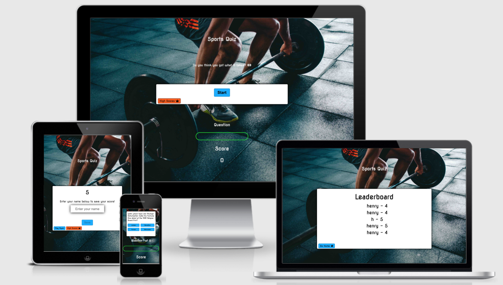
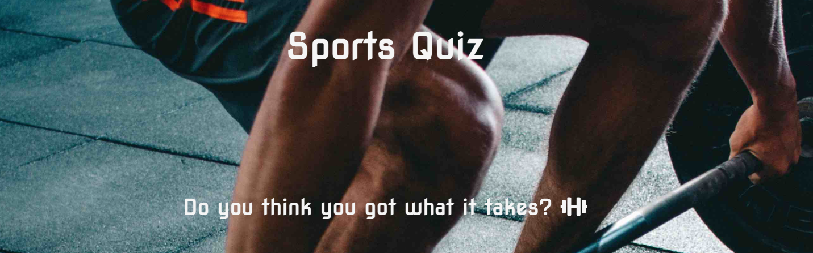
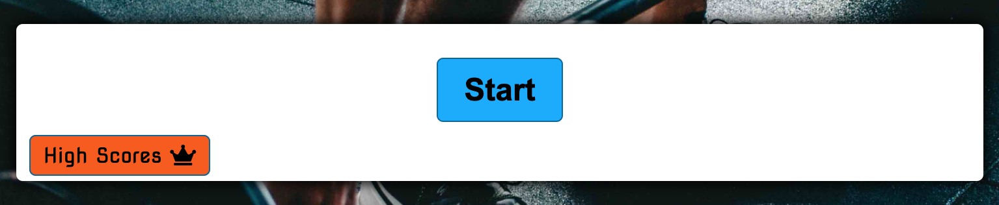
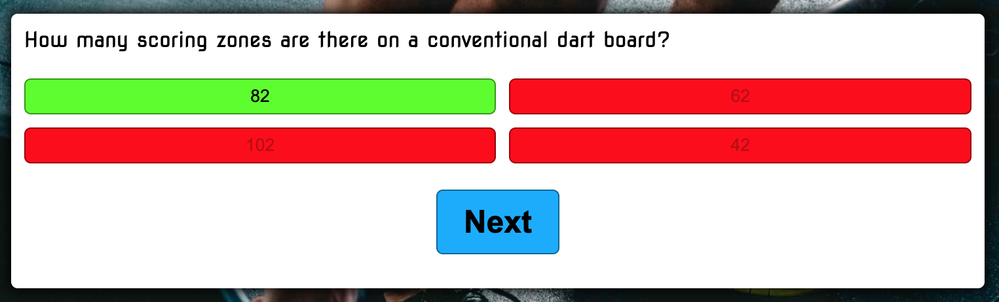
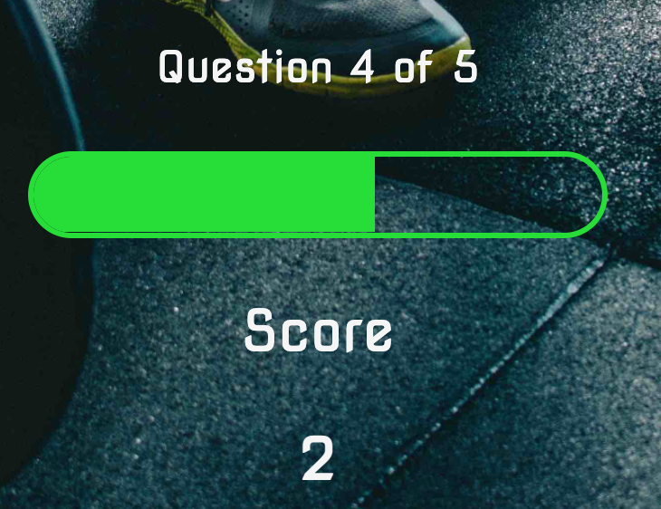
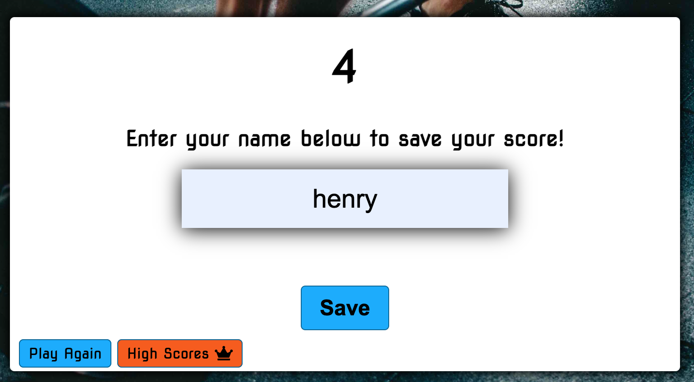
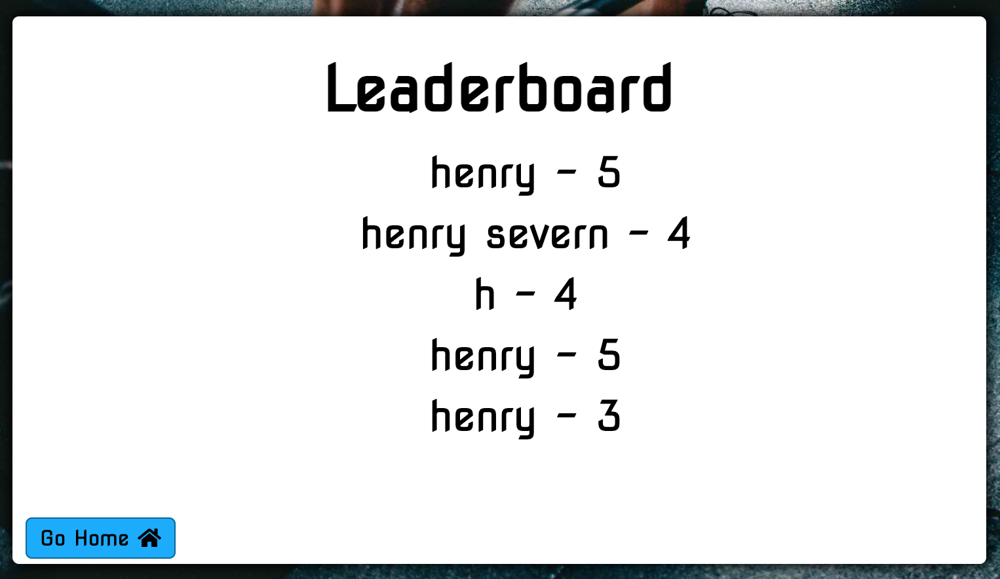

# Sports Quiz App

Sports Quiz app is a application for a quiz based around various sports questions. The app will be targeted towards people looking to test their knowledge on different sports based questions. The app aims to be easy to use, responsive and also fun to play.

## Features 

The website features 3 different pages - Home, score page and a highscores page.

### Home page
The home page features a short message challenging the user to take the quiz, a start button and a highscores link to see the leaderboard. When the start button is pressed the first question will appear along with a progress display. When the answer is selected by the user, and if its correct will display grren and the score will increment. However, if the answer is incorrect it will display red and the score will not increment. The next button will only display once an answer has been selected to move on to the following question. As the questions are asked the progress text and bar will increment. Once all questions have been asked and answered the page will automatically foward to the score page. 

The style of the container aims at being simple and easy to use. The questions are clear to read and the  correct and incorrect answers of the question are displayed after the user has selected.

### Score page
The score page features the final score off the quiz and a chance to save your highscore. All that needs to be done is enter your name and click save. This will automatically save your score to the leaderboard and redirect you back to the high scores page.

### Highscores page 
The Competition page allows the user to enter a competition to win a free meal for two for answering a few questions. This page would be focused on bringing more users to visit the restaurant website and further providing more bookings. The terms and conditions are in a scroll box to allow for a cleaner viewing.

The high scores page allows the user to view their best scores off the quiz. The page also features a home button to easily move betwwen home and highscores pages. This entices the user to continue playing to try and beat their best score.

### Existing Features

- __Title and Opening Message__

- The title is featured across all of the pages
- The opening message only appears on the home page and is removed when the user clicks start.
- The meesage is there to entice the user into taking on the quiz challenge

- __The Game Area__

  - The game area features the questions, answers, start button and the next button.
  - When the start button is clicked a question is asked with four multiple choice answers.
  - Once the user has selected an answer the text will be bold and the coloured background will detemine whether the answer is correct or incorrect (green = correct, red = incorrect).
  - The next button will then display for the next question and set of answers.
  - this area is simple to use with a simple process.

- __The Progress Area__

- The progress area features the current question index, a progress bar and the current score of the user.
- The question index increments as the questions are asked whilst the progress bar increments when the answer has been selected.
- The score will only increment by one if the user selects the correct answer. 
- This section is clear for the user to see what how many questions they've answered and how many are remaining. The progress bar slides up slowly and smoothly for visual affect and is bright green so easy to see over any background.

- __Score Page__

- The score area displays the score the user has achieved from the quiz
- They can choose to save their score if they think it's a good one!
- The input field displays where they need to type their name and the save button will only activate when something has been typed.
- Once the save button is clicked the user will be redirected to the highscores page where they can view their new score.
- The score area also features a play again button without saving if the score was a little embarrasing!

- __Highscores Page__

- The highscores page features a leaderboard displaying the saved scores.
- It will display the name entered and saved along with the score.
- The page also feature a go home button to return to the home page.
- This page is designed to challenge the user to play again and again to reach a better score.

### Features Left to Implement

Some future features to be implemented;
 - The leaderboard to displayed ordered from highest score at the top.
 - Possibly have different backgrounds on random so one is picked out of say 10 different sporting images.
 - More questions.

## Testing 

For all testing documentation, please refer to the [TESTING.md](TESTING.md) file.

### Unfixed Bugs

No visible bugs to be fixed 

## Deployment

The site was deployed to GitHub pages. The steps to deploy are as follows: 
  - In the [GitHub repository](https://github.com/henrysevern/Project-1), navigate to the Settings tab 
  - From the source section drop-down menu, select the **Main** Branch, then click "Save".
  - The page will be automatically refreshed with a detailed ribbon display to indicate the successful deployment.

The live link can be found [here](https://henrysevern.github.io/Project-1)

### Local Deployment

In order to make a local copy of this project, you can clone it. In your IDE Terminal, type the following command to clone my repository:

- `git clone https://github.com/henrysevern/Sports_Quiz_App.git`

Alternatively, if using Gitpod, you can click below to create your own workspace using this repository.

## Credits 

### Content

 - The font used in this project was Nova Square imported from Google fonts.
 - The icons used were imported from Font awsome.
 - Some content was aided by https://www.w3schools.com and JavaScript30
 - Also some content from previous units on the course (Love Running and Coders Coffeehouse) has aided this project.
 - Open Trivia Database (https://opentdb.com/) was used for the sports questions.
 
 ### Media

- All images were imported from Pexel.
