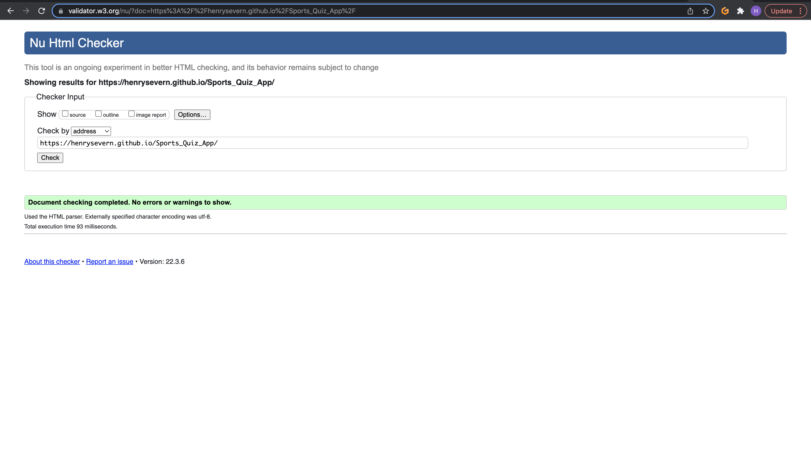
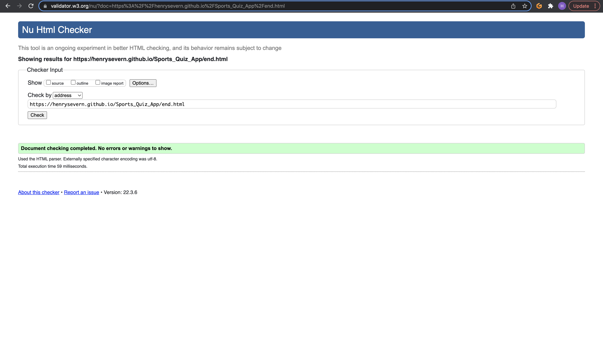
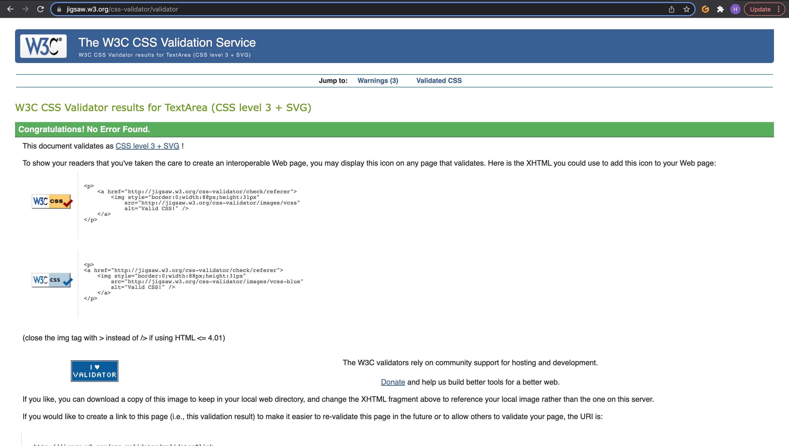
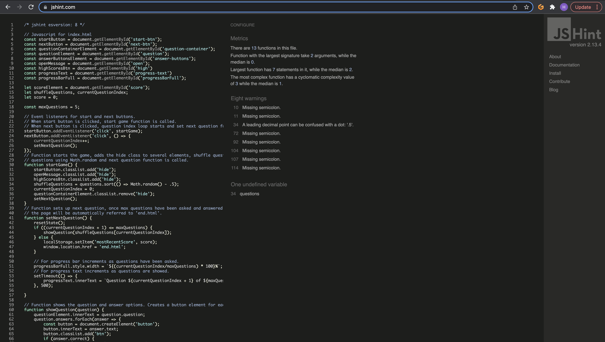
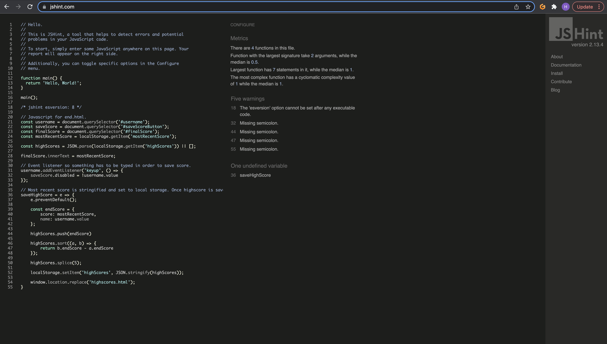
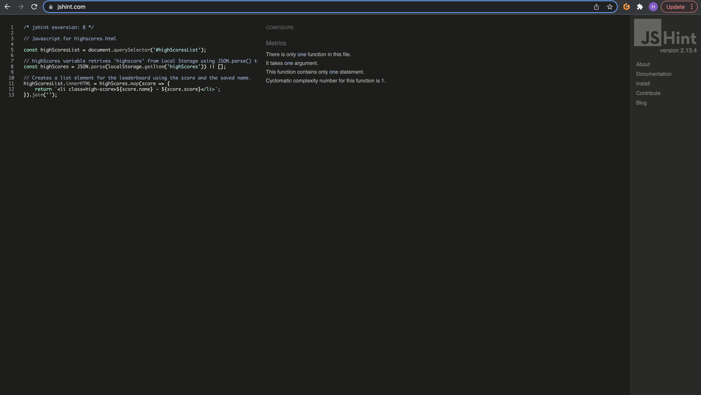

## Code Validation
All code for HTML has been validated through validator.w3, CSS through jigsaw.w3 and Javascript through JSHint and errors have been fixed.

No errors in index.html were found.

No errors in end.html were found.

No errors in highscores.html were found.

No errors in style.css were found.

Some errors were found in quiz.js were missing semi-colons and have been fixed.

Some errors were found in end.js were missing semi-colons and have been fixed. 

No errors in highscores.js were found.

No errors in questions.js were found.

## Browser Compatibility

The website has been tested on 3 different browsers - Chrome, Firefox and Safari. All web browsers respond to the webiste the same and no bugs show up.

The website has been tested over desktop, tablet and mobile devices. The media queries allow the website to display organised and clean throughout all devices. Some provided screenshot below using chrome dev tools and also a screenshot from my phone (Samsung Galaxy S20 Ultra).

Desktop;

Tablet;

Mobile;

Samsung Galaxy S20 Ultra 

